 
<strong>Creating equitable access to the global financial system</strong>

# Stellar Anchor Platform

The Anchor Platform is the easiest and fastest way to deploy a [SEP-compatible](https://github.com/stellar/stellar-protocol/tree/master/ecosystem) anchor service.
 
It implements the majority of standardized API (`SEP`) endpoints that wallets, exchanges, and other applications use, and provides a set of backend HTTPS APIs & callbacks for the anchor to integrate with for specifying fees, exchange rates, and off-chain transaction status updates.

The goal of the Anchor Platform is to abstract all Stellar-specific functionality and requirements for running an anchor, allowing businesses to focus on the core business logic necessary to provide these services.

## Table of Content

The full documentation can be found under the [`docs` directory](/docs), under the structure:

- [00 - Stellar Anchor Platform](/docs/00%20-%20Stellar%20Anchor%20Platform.md)
- [01 - Running & Configuring the Application](/docs/01%20-%20Running%20%26%20Configuring%20the%20Application)
  - [A - Running & Configuring the Application](/docs/01%20-%20Running%20%26%20Configuring%20the%20Application/A%20-%20Running%20%26%20Configuring%20the%20Application.md)
  - [B - Circle Payment Observer](/docs/01%20-%20Running%20%26%20Configuring%20the%20Application/B%20-%20Circle%20Payment%20Observer.md)
- [02 - Contributing](/docs/02%20-%20Contributing)
  - [A - CONTRIBUTING.md](/docs/02%20-%20Contributing/A%20-%20CONTRIBUTING.md)
  - [B - Developer Tools](/docs/02%20-%20Contributing/B%20-%20Developer%20Tools.md)
  - [C - Logging Guidelines](/docs/02%20-%20Contributing/C%20-%20Logging%20Guidelines.md)
  - [D - Database Migration](/docs/02%20-%20Contributing/D%20-%20Database%20Migration.md)
  - [E - Publishing the SDK](/docs/02%20-%20Contributing/E%20-%20Publishing%20the%20SDK.md)
  - [F - Testing with AWS Services](/docs/02%20-%20Contributing/F%20-%20Testing%20with%20AWS%20Services.md)
  - [G - End to End Testing with Different Configs](/docs/02%20-%20Contributing/G%20-%20End%20to%20End%20Testing%20with%20Different%20Configs.md)
- [03 - Implementing the Anchor Server](/docs/03%20-%20Implementing%20the%20Anchor%20Server)
  - [Communication](/docs/03%20-%20Implementing%20the%20Anchor%20Server/Communication)
    - [Callback API](/docs/03%20-%20Implementing%20the%20Anchor%20Server/Communication/Callbacks%20API.yml)
    - [Events Schema](/docs/03%20-%20Implementing%20the%20Anchor%20Server/Communication/Events%20Schema.yml)
    - [Platform API](/docs/03%20-%20Implementing%20the%20Anchor%20Server/Communication/Platform%20API.yml)
- [04 - Subprojects Usage](/docs/04%20-%20Subprojects%20Usage) `// In progress...`
  - [A - Circle Payment Service](/docs/04%20-%20Subprojects%20Usage/A%20-%20Circle%20Payment%20Service.md)

## Definitions

Here are the important terminology used in this project:

- **Anchor**: on/off ramps of the Stellar network. More information is available [here](https://developers.stellar.org/docs/anchoring-assets/).
- **Wallet**: a frontend application used to interact with the Stellar network on behalf of a user.
- **Sending Anchor**: a terminology used in the context of [SEP-31]. Refers to an entity that receives funds from a user and forwards it (after taking a fee) to a receiving anchor, in the SEP-31 `Sending Client->Sending Anchor->Receiving Anchor-> Receiving Client` flow.
- **Receiving Anchor**: a terminology used in the context of [SEP-31]. Refers to an entity that receives funds from a user and forwards it (after taking a fee) to a receiving client (or recipient), in the SEP-31 `Sending Client->Sending Anchor->Receiving Anchor-> Receiving Client` flow. This is what the Anchor Platform currently implements.
- **Ecosystem**: the community of entities and users that utilize the Stellar network and/or provide solutions on the Stellar network.
- **Anchor Platform (or Platform)**: the web application that will be exposing public endpoints and APIs. It is compliant with the [SEPs] to guarantee interoperability in the Stellar network and delegates business-specific logic to the Anchor Server.
- **Anchor Server**: a microservice that will be responsible for the Anchor-specific business logic used in the Anchor Platform. This service interacts with the Anchor Platform to perform some actions like:
  - Calculate conversion rates between two assets.
  - Create or update a customer account.
  - Notify the Anchor about an incoming payment.
- **Anchor Reference Server**: an Anchor Server implementation that is shipped as part of this repository for testing purposes.
- **Callback API (`Sync Platform->Anchor`)**: a synchronous API that the Platform will use to gather a business-specific data from the Anchor Server, in order to perform a SEP-compliant operation (like exchange rate or user registration, for instance)
- **Events Queue (`Async Platform->Anchor`)**: an asynchronous communication venue that the Platform will use to notify the Anchor Server about a pending action, like an incoming payment that needs to be processed.
- **Platform API (`Sync Anchor->Platform`)**: a synchronous API that the Anchor can use to fetch information (e.g. transactions or quotes) and also update the data of transactions stored in the Platform database.
- **[SEPs]**: it means Stellar Ecosystem Proposals and refers to standards that are used by Stellar ecosystem participants to achieve interoperability in the network. The ones implemented by this project are:
  | Standard |                                  Description                                   | Configurable | Interacts with Anchor Server | Supported by the Platform API | Supported by the SDK |
  | :------: | :----------------------------------------------------------------------------: | :----------: | :--------------------------: | :---------------------------: | :------------------: |
  | [SEP-10] |                            Handles authentication.                             |     YES      |              NO              |              YES              |         YES          |
  | [SEP-12] |                                  Handles KYC.                                  |     YES      |             YES              |              YES              |         YES          |
  | [SEP-24] |       Handles deposit & withdrawal of assets in/out the Stellar network.       |     NO       |              NO              |              NO               |         NO           |
  | [SEP-31] | Used for international remittances. **Only the receiver side is implemented.** |     YES      |             YES              |              YES              |         YES          |
  | [SEP-38] |                Used for [rfq] **in conjunction with [SEP-31]**.                |     YES      |             YES              |              YES              |         YES          |

## Microservices

In order to deploy this project, you'll need to have the following microservices running:

- **Database Server**: usually, you'll use a relational database like MySQL or PostgreSQL, but we also support SQLite, commonly used in local development.
- **Queue Service**: we currently support [Kafka](https://kafka.apache.org/) and [Amazon SQS](https://aws.amazon.com/sqs/).
- **Anchor Platform Server**: this is the main application that will be providing public endpoints for your Anchor application.
- **Anchor Server**: this is the microservice that will be responsible for the Anchor-specific business logic used in the Anchor Platform.

## Architecture

The following image shows the architecture of the Anchor Platform, as well as how it interacts with the Anchor Server and the Wallet/Client/Sending Anchor.

As you can see, the Anchor Platform receives interactions from ecosystem participants and deals with the interoperability part described in the SEPs. The Anchor Server is only called when there is a pending action to be performed.

This drastically reduces the amount of code that needs to be written by the Anchor, and allows them to focus on the business logic that's specific to their businesses and use cases.

## SEP-31 Flow

Here you can see the sequence diagram of the [SEP-31] flow, showing all the stakeholders, as well as the communication between Platform and Anchor Server. Please notice this flow includes quotes ([SEP-38]) but they may not be needed for your use-case:

```mermaid
%% Happy path SEP-31 transaction flow with new customers
%% View at: https://mermaid.live
%% Assumptions:
%% - The KYC information provided by the sender is valid on first attempt
%% - The client does not request customer status callbacks
%% - The anchor successfully delivers off-chain funds on first attempt
sequenceDiagram
    title: SEP-31 Transaction Flow
    participant Client as SEP-31 Sending Anchor
      Note over Client: In the SEP-31 flow, this is the Sending Anchor.
    participant Platform
      Note over Platform: In the SEP-31 flow, this is the Receiving Anchor.
    participant Anchor
    participant Stellar
    participant Recipient
    Client->>+Platform: GET /.well-known/stellar.toml
    Platform-->>-Client: SEP-10, 12 & 31 URLs
    Client->>+Platform: GET [SEP-31]/info
    Platform-->>-Client: assets, customer types, fees
    Client->>+Platform: GET [SEP-10]
    Platform-->>-Client: challenge transaction
    Client-->>Client: signs challenge
    Client->>+Platform: POST [SEP-10]
    Platform-->>Platform: verifies challenge
    Platform-->>-Client: authentication token

    rect rgb(243,249,255)
      loop Sending and Receiving Customer
        Client->>+Platform: GET [SEP-12]/customer?type=
        Platform->>+Anchor: forwards request
        Anchor-->>-Platform: fields required
        Platform-->>Platform: updates customer status (NEEDS_INFO)
        Platform-->>-Client: forwards response
        Client-->>Client: collects fields
        Client->>+Platform: PUT [SEP-12]/customer?type=
        Platform->>+Anchor: forwards request
        Anchor-->>Anchor: validates KYC values
        Anchor-->>-Platform: id, ACCEPTED
        Platform-->>Platform: updates customer status (ACCEPTED)
        Platform-->>-Client: forwards response
      end
    end

    rect rgb(249,255,243)
      opt Get a Quote if Quotes are Supported or Required
        Client->>+Platform: GET [SEP-38]/price
        Platform->>+Anchor: GET /rate?type=indicative_price
        Anchor-->>-Platform: exchange rate
        Platform-->>-Client: exchange rate
        Client-->>Client: confirms rate
        Client->>+Platform: POST [SEP-38]/quote
        Platform->>+Anchor: GET /rate?type=firm
        Anchor-->>-Platform: exchange rate, expiration
        Platform-->>Client: quote id, rate, expiration
        Platform->>+Anchor: POST [webhookURL]/quote created
        Anchor-->>-Platform: 204 No Content
      end
    end

    Client->>+Platform: POST [SEP-31]/transactions
    Platform-->>Platform: checks customer statuses, links quote
    
    rect rgb(249,255,243)
      opt Get the Fee if Quotes Were Not Used
        Platform->>+Anchor: GET /fee
        Anchor-->>Anchor: calculates fee
        Anchor-->>-Platform: fee
      end
    end
    
    Platform-->>Platform: Sets fee on transaction
    Platform-->>-Client: transaction id, receiving account & memo

    Platform->>+Anchor: POST [webhookURL]/transactions created
    Anchor-->>-Platform: 204 No Content
    Client->>+Stellar: submit Stellar payment
    Stellar-->>Platform: receives payment, matches w/ transaction
    Platform-->>Platform: updates transaction status to `pending_receiver`
    Stellar-->>-Client: success response
    Platform->>+Anchor: POST [webhookURL]/transactions received
    Anchor-->>Anchor: queues off-chain payment
    Anchor-->>-Platform: 204 No Content
    Anchor->>Recipient: Sends off-chain payment to recipient

    rect rgb(255,243,249)
      opt Mismatched info when delivering value to the Recipient (or a similar error)
        Recipient-->>Anchor: error: Recipient info was wrong
        Anchor-->>Anchor: Updates the receiver customer info from ACCEPTED to NEEDS_INFO
        Anchor->>+Platform: PATCH /transactions to mark the status as `pending_customer_info_update`
        Platform-->>Platform: updates transaction to `pending_customer_info_update`
        Platform-->>-Anchor: updated transaction
        Client->>+Platform: GET /transactions?id=
        Platform-->>-Client: transaction `pending_customer_info_update`

        Client->>+Platform: GET [SEP-12]/customer?id=&type=
        Platform->>+Anchor: forwards request
        Anchor-->>Anchor: validates KYC values
        Anchor-->>-Platform: id, NEEDS_INFO, fields
        Platform-->>-Client: forwards response

        Client->>+Platform: PUT [SEP-12]/customer?id=&type=
        Platform->>+Anchor: forwards request
        Anchor-->>Anchor: validates KYC values
        Anchor-->>-Platform: id, ACCEPTED
        Platform-->>-Client: forwards response

        Anchor->>+Platform: PATCH /transactions to mark the status as `pending_receiver`
        Platform-->>Platform: updates transaction to `pending_receiver`
        Platform-->>-Anchor: updated transaction
        Anchor-->>Anchor: queues off-chain payment
        Anchor->>Recipient: Sends off-chain payment to recipient
      end
    end

    Recipient-->>Anchor: successfully delivered funds to Recipient
    Anchor->>+Platform: PATCH /transactions to mark the status as `completed`
    Platform-->>Platform: updates transaction to `completed`
    Platform-->>-Anchor: updated transaction
    Client->>+Platform: GET /transactions?id=
    Platform-->>-Client: transaction complete
    Client-->>Client: notifies sender
```

> Note: in terms of database usage for SEP-31, our tests indicate that each SEP-31 (with SEP-38) transaction occupies ~2KB of space in the database. The tests also indicate the data space usage tends to decrease as the number of SEP-31 transactions increases. These results were achieved by executing 500 SEP-31 transactions on a Postgres database.

## Subprojects

The Stellar Anchor SDK is a collection of projects that make easy to build financial applications on Stellar:

* [api-schema](/api-schema): the API interfaces, request, response classes.
* [core](/core): the base package for implementing standardized anchor applications.
* [payment](/payment): implementation of payment service with [Circle API](https://developers.circle.com/reference).
* [platform](/platform): the anchor platform [Spring Boot Application with WebMVC](https://spring.io/guides/gs/serving-web-content/).
* [anchor-reference-server](/anchor-reference-server): the reference implementation of the anchor server.
* [service-runner](/service-runner): the runner class for the platform, reference server and payment observer. 
* [integration-tests](/integration-tests): the integration tests for the platform, reference server, and payment observers.  

While the project is in its early stages and in active development, it is used in production today by businesses providing services on Stellar.

## Configuration

To learn how to run and configure this project, please refer to [01.A - Running & Configuring the Application](/docs/01%20-%20Running%20%26%20Configuring%20the%20Application/A%20-%20Running%20%26%20Configuring%20the%20Application.md).

## Contributing

Please refer to our [0.2.A - CONTRIBUTING](/docs/02%20-%20Contributing/A%20-%20CONTRIBUTING.md) guide for more information on how to contribute to this project.

[SEPs]: https://github.com/stellar/stellar-protocol/tree/master/ecosystem
[SEP-10]: https://stellar.org/protocol/sep-10
[SEP-12]: https://stellar.org/protocol/sep-12
[SEP-24]: https://stellar.org/protocol/sep-24
[SEP-31]: https://stellar.org/protocol/sep-31
[SEP-38]: https://stellar.org/protocol/sep-38
[rfq]: https://en.wikipedia.org/wiki/Request_for_quotation
