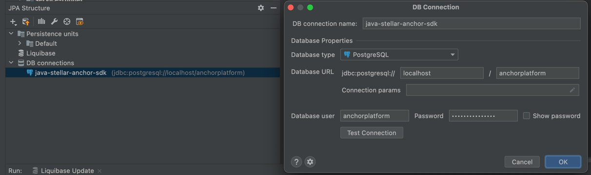
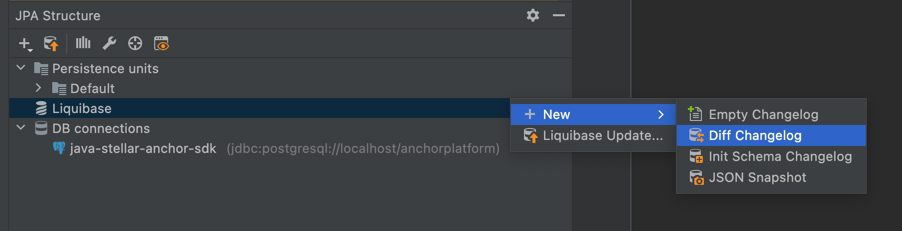

# Database Migrations

Liquibase is used by this project for database migrations. Liquibase is able to generate changelogs (migration scripts)
and Spring will automatically apply the changes to the database.

Install JPA Buddy for IntelliJ
(https://plugins.jetbrains.com/plugin/15075-jpa-buddy)

## Add a database connection
Go to JPA Structure -> DB connections -> right click `new` -> DB connection

## Generate a new changelog file
1) When data models or table names are changed, a new changelog should be generated. 

2) Review the changes and generate the changelog.

Note: `Directory` should be set to ``platform/src/main/resources/db/changelog/`` so all the changelog files are in one place.

3) Add the generated changelog file to platform/resources/db.changelog/db.changelog-master.yaml
