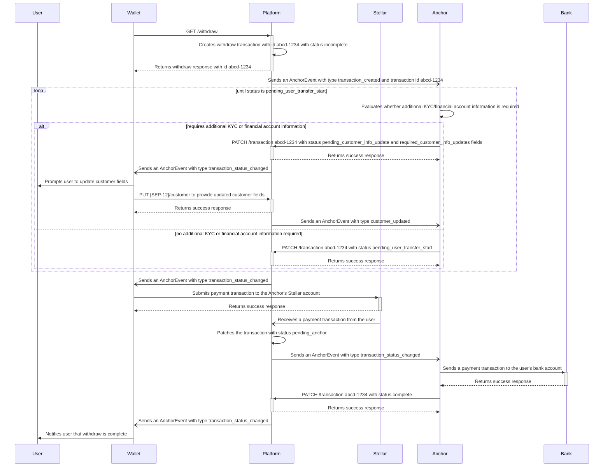

### Withdraw

This diagram illustrates the withdraw flow. The flow starts after the user has authenticated with the anchor via SEP-10 and provided some basic information about themselves. The example here shows the user withdrawing funds to their bank account, but the flow is similar for other withdrawal methods. The `withdraw-exchange` flow works similarly, but the Platform will additionally verify the quote requested or make a call to the Fee integration to update amounts.

For more information on the withdraw flow, see the [SEP-6](https://github.com/stellar/stellar-protocol/blob/master/ecosystem/sep-0006.md) specification.

