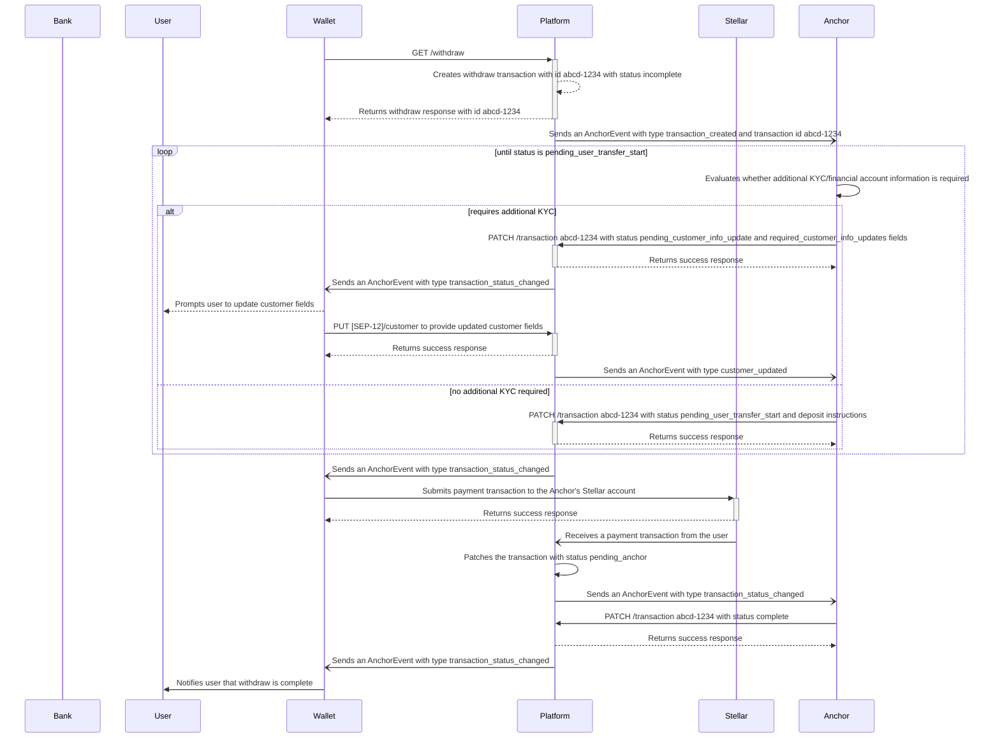

```mermaid
sequenceDiagram
  participant Bank
  participant User
  participant Wallet
  participant Platform
  participant Stellar
  participant Anchor

  Wallet->>+Platform: GET /withdraw
  Platform-->>Platform: Creates withdraw transaction with id abcd-1234 with status incomplete
  Platform-->>-Wallet: Returns withdraw response with id abcd-1234
  Platform-)Anchor: Sends an AnchorEvent with type transaction_created and transaction id abcd-1234
  loop until status is pending_user_transfer_start
    Anchor->>Anchor: Evaluates whether additional KYC/financial account information is required
    alt requires additional KYC
      Anchor->>+Platform: PATCH /transaction abcd-1234 with status pending_customer_info_update and required_customer_info_updates fields
      Platform-->>-Anchor: Returns success response
      Platform-)Wallet: Sends an AnchorEvent with type transaction_status_changed
      Wallet-->>User: Prompts user to update customer fields
      Wallet->>+Platform: PUT [SEP-12]/customer to provide updated customer fields
      Platform-->>-Wallet: Returns success response
      Platform-)Anchor: Sends an AnchorEvent with type customer_updated
    else no additional KYC required
      Anchor->>+Platform: PATCH /transaction abcd-1234 with status pending_user_transfer_start and deposit instructions
      Platform-->>-Anchor: Returns success response
    end
  end
  Platform-)Wallet: Sends an AnchorEvent with type transaction_status_changed
  Wallet->>+Stellar: Submits payment transaction to the Anchor's Stellar account
  Stellar-->>-Wallet: Returns success response
  Stellar-)Platform: Receives a payment transaction from the user
  Platform->>Platform: Patches the transaction with status pending_anchor
  Platform-)Anchor: Sends an AnchorEvent with type transaction_status_changed
  Anchor->>Platform: PATCH /transaction abcd-1234 with status complete
  Platform-->>Anchor: Returns success response
  Platform-)Wallet: Sends an AnchorEvent with type transaction_status_changed
  Wallet->>User: Notifies user that withdraw is complete
```